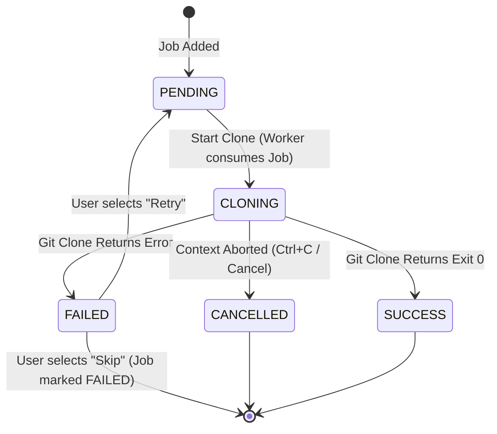

# Workspace & Microservices Setup Automation Tool

[](https://golang.org)
[](https://wails.io)
[](#)

*Đọc tài liệu này bằng ngôn ngữ khác: [Tiếng Việt (Vietnamese)](file:///Users/admin2/my_projects/p-git-tool/README.vi.md)*

The **Workspace & Microservices Setup Automation Tool** is a lightweight, secure, and fault-tolerant cross-platform application designed to automate the process of setting up localized development task workspaces. It simplifies cloning hundreds of repositories across microservices systems, managing credentials securely via native OS keyrings, syncing repository metadata from Git hosting providers (GitHub/GitLab APIs), and executing pipelines cleanly.

It provides two user-facing interfaces built from a unified Go core:
1. **Interactive CLI**: Built using Go and the `survey` prompt library.
2. **Desktop GUI**: Built using Wails (Go + Vite HTML/JS/CSS) featuring a custom Space Dark theme with Glassmorphism and real-time Git progress stream terminal.

---

## Table of Contents

- [Key Features](#key-features)
- [Tech Stack](#tech-stack)
- [Prerequisites](#prerequisites)
- [Getting Started](#getting-started)
  - [1. Clone the Repository](#1-clone-the-repository)
  - [2. Install Dependencies](#2-install-dependencies)
  - [3. Running the CLI Interface](#3-running-the-cli-interface)
  - [4. Running the Desktop GUI (Development)](#4-running-the-desktop-gui-development)
  - [5. Building the Executable Binary](#5-building-the-executable-binary)
- [Architecture & Design](#architecture--design)
  - [Directory Structure](#directory-structure)
  - [Data Pipeline & State Machine](#data-pipeline--state-machine)
  - [Execution Flow](#execution-flow)
- [Configuration & Data Storage](#configuration--data-storage)
  - [File Paths](#file-paths)
  - [JSON Database Schemas](#json-database-schemas)
  - [Secure Token Storage (OS Keyring)](#secure-token-storage-os-keyring)
- [CSV Bulk Import Specification](#csv-bulk-import-specification)
- [Git Provider API Sync](#git-provider-api-sync)
- [Error Handling & Logging](#error-handling--logging)
  - [Error Catalog](#error-catalog)
  - [Logging Architecture](#logging-architecture)
- [Troubleshooting](#troubleshooting)
- [License](#license)

---

## Key Features

- **Secure Token Storage**: Leverages native OS credential managers (Windows Credential Manager, macOS Keychain, Linux secret-service) via `zalando/go-keyring` to store Personal Access Tokens (PATs) and passwords securely. Never writes plain-text credentials to disk.
- **Fault-Tolerant Sequential Clone Pipeline**: Employs a worker pool executing cloning tasks sequentially. If a task fails (due to incorrect credentials, network timeouts, etc.), the pipeline pauses and prompts the user to either **Retry** or **Skip** before moving on.
- **Log Masking & Safety**: A regex-based masking engine intercepts all logs to replace any plain-text credentials in URLs with `***` before printing to terminal or writing to file.
- **Graceful Cancellation & Cleanup**: Terminating a clone job (via `Ctrl+C` in CLI or the *Cancel* button in GUI) instantly signals the context of the running Git child processes. Partially cloned directories are automatically purged to prevent stale files.
- **CSV Bulk Import & Smart Merge**: Allows importing lists of repositories via CSV. Parses complex tag columns and merges them with existing local tag mappings, preventing overwrite conflicts.
- **API Synchronization**: Fetches ownership/collaborator repositories directly from GitHub/GitLab API using users' PATs. Handles pagination using `Link` or `X-Next-Page` headers.
- **Sleek Space Dark GUI**: Wails-backed responsive interface styled with vibrant HSL colors, modern typography, subtle glow-effects, and a monospace console box showing live git progress logs streamed via Go channels.

---

## Tech Stack

*   **Language**: Go 1.26.3
*   **GUI Engine**: Wails v2.12.0
*   **GUI Frontend**: HTML5 / JavaScript (Vite) / Vanilla CSS (Responsive Glassmorphism design)
*   **CLI UI Library**: `github.com/AlecAivazis/survey/v2`
*   **Secure Storage**: `github.com/zalando/go-keyring`
*   **Log Rotator**: `gopkg.in/natefinch/lumberjack.v2`
*   **UUID Generator**: `github.com/google/uuid`

---

## Prerequisites

To compile or run this project from source, you will need:

1.  **Go SDK**: Version 1.26.3 or higher.
2.  **Git**: Installed and accessible in your system's `PATH`.
3.  **Node.js & npm/pnpm** *(required for GUI only)*: Node.js 18+ to bundle the frontend code.
4.  **Wails CLI** *(required for GUI only)*: Install via Go command:
    ```bash
    go install github.com/wailsapp/wails/v2/cmd/wails@v2.12.0
    ```
5.  **CGO Compiler**: 
    - Windows: MSYS2 or MinGW-w64.
    - macOS: Xcode Command Line Tools.
    - Linux: `build-essential` and development libraries (`libgtk-3-dev`, `libwebkit2gtk-4.0-dev` or `libwebkit2gtk-4.1-dev` depending on distro).

---

## Getting Started

### 1. Clone the Repository

```bash
git clone https://github.com/user/workspace-tool.git
cd workspace-tool
```

### 2. Install Dependencies

Install the Go backend packages:
```bash
go mod download
```

Install the JavaScript frontend modules for Wails GUI:
```bash
cd cmd/gui/frontend
npm install
cd ../../..
```

### 3. Running the CLI Interface

Execute the interactive command-line app:
```bash
go run cmd/cli/main.go
```

The CLI features interactive prompts:
*   Use Arrow keys (`↑`/`↓`) to navigate choices.
*   Press `Space` to multi-select options.
*   Press `Enter` to confirm a selection.

### 4. Running the Desktop GUI (Development)

Run the Wails application in live-development mode (enables hot-reloads for Go code changes and CSS/JS changes):
```bash
cd cmd/gui
wails dev
```

### 5. Building the Executable Binary

To compile a production-ready, optimized executable:

#### CLI Binary:
```bash
go build -o build/cli-tool cmd/cli/main.go
```

#### GUI Desktop Application:
```bash
cd cmd/gui
wails build
```
The compiled desktop app will be created inside the `cmd/gui/build/bin/` directory (e.g., `gui.exe` on Windows or `gui.app` on macOS).

---

## Architecture & Design

The application follows the principles of **Clean Architecture** to segregate logic layer from presentation clients (CLI and Wails GUI). The core business rules have zero dependencies on CLI or GUI frameworks.

### Directory Structure

```text
/
├── cmd/
│   ├── cli/            # Entry point for the CLI tool (Survey UI)
│   └── gui/            # Entry point for Wails Desktop App & Wails Go bindings
│       ├── build/      # Compilation assets and desktop icons
│       └── frontend/   # SPA Frontend (Vite + Vanilla JS + CSS System)
├── internal/
│   ├── domain/         # Core business entities, enums, event schemas
│   ├── repository/     # Data storage & Persistence adapters
│   │   ├── config_repo.go  # User configuration and repository CRUD
│   │   ├── auth_helpers.go # Auth profile metadata management
│   │   ├── keyring_repo.go # OS secure keyring interface
│   │   ├── csv_parser.go   # CSV parsing, validation, and merges
│   │   └── migrator.go     # JSON schema versioning and migrations
│   ├── usecase/        # Business workflow logic (Orchestrators)
│   │   ├── clone_pipeline.go # Worker pool running clone jobs sequentially
│   │   └── git_sync.go     # Syncing with Git provider APIs (GitHub/GitLab)
│   └── infrastructure/ # Low-level OS wrappers and services
│       ├── git_executor.go # Git command runner, log streamer, error parser
│       └── logger.go       # System log recorder with URL masking
├── go.mod              # Go module definition
└── go.sum              # Go dependencies checksums
```

### Data Pipeline & State Machine

Each repository clone job within the pipeline is governed by a strict state machine to prevent race conditions:



#### State Transition Rules:
1.  A job can transition to `CLONING` only if its current state is `PENDING` or `FAILED` (upon user selecting retry).
2.  `SUCCESS`, `CANCELLED` are terminal states and cannot be mutated.
3.  If a job is `FAILED`, execution stops, blocking the pipeline and triggering a UI prompt.

### Execution Flow

```mermaid
sequenceDiagram
    participant UI as Presentation (CLI / GUI)
    participant Core as ClonePipeline
    participant Exec as GitExecutor
    participant OS as Git / OS FS

    UI->>Core: StartClone(repos, targetRoot)
    loop For each repository
        Core->>Exec: Clone(ctx, job)
        Exec->>OS: exec.CommandContext("git clone")
        Note over Exec,OS: Streaming stdout/stderr in real-time
        Exec-->>UI: emit "CLONE_PROGRESS" (streamed logs)
        
        alt Success
            OS-->>Exec: exit 0
            Exec-->>Core: nil
            Core-->>UI: emit "JOB_COMPLETED"
        else Failure (e.g., Auth or Network error)
            OS-->>Exec: exit error code
            Exec->>OS: os.RemoveAll(TargetDir) (Cleanup)
            Exec-->>Core: error
            Core-->>UI: emit "clone_error_prompt" (Pause Pipeline)
            UI->>Core: SendFailureResponse("retry" or "skip")
            alt Retry selected
                Note over Core: Resets state to PENDING and restarts loop for same job
            alt Skip selected
                Core-->>UI: emit "JOB_FAILED"
                Note over Core: Continues to the next repo in queue
            end
        end
    end
    Core-->>UI: Pipeline Finished (Close Channel)
```

---

## Configuration & Data Storage

### File Paths

User data is preserved inside dedicated OS configuration directories:
*   **Windows**: `%APPDATA%\workspace-tool\` (e.g. `C:\Users\username\AppData\Roaming\workspace-tool`)
*   **macOS**: `~/Library/Application Support/workspace-tool/`
*   **Linux**: `~/.config/workspace-tool/`

The storage directory contains:
*   `config.json`: Stores workspace path settings and metadata profiles for authentication.
*   `repos.json`: Stores the index list of microservice repositories.
*   `logs/app.log`: Rotating application debug logs.

### JSON Database Schemas

The configuration repository includes an automatic migration engine (`migrator.go`).

#### `config.json` (Schema Version: 1)
```json
{
  "version": 1,
  "config": {
    "default_root_path": "C:\\Users\\admin\\Workspaces",
    "worker_count": 1
  },
  "auth_profiles": [
    {
      "id": "e457f006-2580-4966-bfd7-e23f05b828ef",
      "name": "Github Personal",
      "provider": "github",
      "username": "my-username",
      "is_default": true
    }
  ]
}
```

#### `repos.json` (Schema Version: 2)
```json
{
  "version": 2,
  "data": [
    {
      "id": "uuid-repo-1",
      "name": "auth-service",
      "url": "https://github.com/my-org/auth-service.git",
      "auth_profile_id": "e457f006-2580-4966-bfd7-e23f05b828ef",
      "tags": [
        "github",
        "backend",
        "go"
      ],
      "description": "Handles auth token distribution"
    }
  ]
}
```

### Secure Token Storage (OS Keyring)

Personal Access Tokens (PATs) and passwords are never saved in the JSON files. When creating an Auth Profile:
1.  The profile metadata is added to `config.json`.
2.  The sensitive token is written to the system's keyring:
    *   **Service Name**: `workspace-tool`
    *   **Account Name**: `<Profile-ID>` (UUID)

---

## CSV Bulk Import Specification

You can import bulk repositories by loading a `.csv` file. 

### CSV File Header Format:
The file must contain headers. The parser automatically normalizes and trims spaces. The required headers are `name` and `url`. Optional headers are `tags` and `auth_profile` (maps to an existing Auth Profile ID).

```csv
name,url,tags,auth_profile
api-gateway,https://github.com/my-org/api-gateway.git,gateway;backend;node,e457f006-2580-4966-bfd7-e23f05b828ef
auth-ui,git@github.com:my-org/auth-ui.git,frontend;react,
user-service,ssh://git@github.com:7999/my-org/user-service.git,backend;go,
```

### Validation & Merge Strategy Rules:
- **Url Validations**: Supports standard URLs (`https://` or `http://`), SSH URLs (`git@`), and alternative SSH URLs (`ssh://`).
- **Upsert Matching**: If a repository URL in the CSV already exists in `repos.json`, it updates the repository's name and authentication profile, but merges the tags. 
- **Tags Splitting**: Tags can be separated using commas `,` or semicolons `;`. The parser automatically normalizes them to lowercase and filters out duplicates.
- **Cleanup**: If names conflict with other existing repositories during bulk parsing, the conflicting row is skipped, and a warning is printed to the system log.

---

## Git Provider API Sync

Syncing automatically scans and registers repositories owned by the user or their associated organizations.

1.  **Endpoint Targets**:
    - **GitHub**: `GET https://api.github.com/user/repos?affiliation=owner,collaborator&per_page=100`
    - **GitLab**: `GET https://gitlab.com/api/v4/projects?membership=true&per_page=100`
2.  **Authentication**: Injects the PAT token in the `Authorization: Bearer <token>` header.
3.  **Pagination Handling**:
    - GitHub uses the RFC 5988 `Link` header: `<...>; rel="next"`.
    - GitLab uses the custom header `X-Next-Page`.
4.  **Upsert Sync Logic**: Repository URLs synced from the API are cross-referenced with `repos.json`. Synced names are updated, and Git tags (`github` or `gitlab`) are added. Local tags created by the user are preserved and merged.

---

## Error Handling & Logging

### Error Catalog

The core package maps execution failures to a unified set of error strings:

| Error Code | Triggering Scenario | Action taken by App |
| :--- | :--- | :--- |
| `ERR_GIT_NOT_FOUND` | `git` executable is not detected in system's `PATH` env. | Aborts setup immediately before starting any clones. |
| `ERR_DIR_EXISTS` | Target workspace directory already exists and is *not* empty. | Pauses and asks user to retry or skip. |
| `ERR_AUTH_REJECTED` | Git fails with terminal auth prompt or credentials rejection. | Pauses and displays credential configuration warning. |
| `ERR_NETWORK_TIMEOUT` | Git remote network connection drops or times out. | Pauses, allowing user to fix connection and select "Retry". |
| `ERR_CLONE_CANCELLED` | The user halts the execution (CLI: `Ctrl+C`, GUI: "Cancel"). | Purges the target folder of the active job, exits loop. |

### Logging Architecture

- **Logging Library**: Powered by `lumberjack`.
- **System Logs Path**: Saved to `<storage-dir>/logs/app.log`.
- **Rotation Configuration**: 
  - Max File Size: `10 MB`
  - Max Backups Kept: `5 files`
  - Max Age: `28 days`
  - Compression: Enabled (saves old rotated files as `.gz`).
- **Credential Masking Engine**: A system-wide middleware filters all stdout stream data and logger input using the regular expression:
  `(?i)(https?://)([^:]+):([^@\s/]+)@`
  It replaces the password/token portion (`$3`) with `***` before writing logs or outputting events.

---

## Troubleshooting

### 1. Error: `ERR_GIT_NOT_FOUND`
*   **Cause**: Git is either not installed or its installation directory is not added to your system's Environment Variables (`PATH`).
*   **Resolution**: 
    - Windows: Install Git for Windows and ensure "Add Git to PATH" is checked.
    - macOS: Run `xcode-select --install` or install Git via Homebrew (`brew install git`).
    - Verify by running `git --version` in a fresh terminal.

### 2. OS Keyring Access Errors on Linux
*   **Cause**: Linux distributions running without a graphical session or dbus instance can fail to bind to the secret service.
*   **Resolution**: Ensure `dbus-user-session` and `gnome-keyring` (or `pass`) are installed. For headless environments, export the DBUS session parameters:
    ```bash
    export $(dbus-launch)
    ```

### 3. Wails GUI displays black screen or fails to run
*   **Cause**: WebKit2GTK is missing (Linux) or GPU acceleration conflicts with Wails.
*   **Resolution**:
    - Debian/Ubuntu: `sudo apt install libwebkit2gtk-4.0-dev` (or `libwebkit2gtk-4.1-dev`).
    - Run the application with GPU disabled if drivers mismatch:
      ```bash
      wails dev -gpulimit
      ```

### 4. Git clone fails with SSH URL but works in terminal
*   **Cause**: The background Go wrapper runs without inherit-binding the SSH agent, or your custom SSH key uses a passphrase that requires terminal input.
*   **Resolution**: Add your private key to your ssh-agent first:
    ```bash
    ssh-add ~/.ssh/id_rsa
    ```

---

## License

This project is licensed under the MIT License. See [LICENSE](#) for details.
