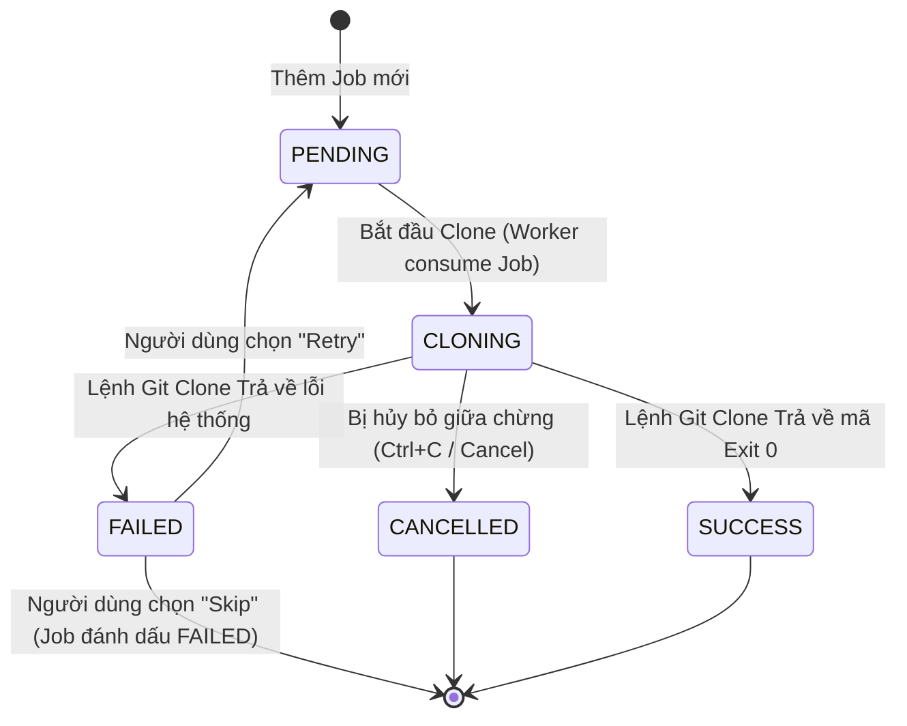

# Công cụ Tự động hóa Thiết lập Workspace & Microservices

[](https://golang.org)
[](https://wails.io)
[](#)

*Read this documentation in another language: [English](file:///Users/admin2/my_projects/p-git-tool/README.md)*

**Công cụ Tự động hóa Thiết lập Workspace & Microservices** là một ứng dụng đa nền tảng gọn nhẹ, bảo mật và kháng lỗi cực cao được thiết kế nhằm tự động hóa quy trình thiết lập các thư mục làm việc (task workspaces) cục bộ cho lập trình viên. Công cụ đơn giản hóa việc clone hàng trăm repository trong các hệ thống microservices phức tạp, quản lý thông tin xác thực an toàn qua Keyring của hệ điều hành (OS Keyrings), đồng bộ siêu dữ liệu repository trực tiếp từ API của nhà cung cấp Git (GitHub/GitLab) và thực thi pipeline một cách sạch sẽ.

Dự án cung cấp hai giao diện người dùng dựa trên một lõi Go duy nhất:
1.  **CLI Tương tác (Interactive CLI)**: Được viết bằng Go kết hợp thư viện khảo sát dòng lệnh `survey`.
2.  **Desktop GUI**: Được phát triển trên nền tảng Wails (Go + Vite HTML/JS/CSS) với thiết kế Space Dark tối giản hiện đại sử dụng Glassmorphism cùng màn hình terminal stream log trực tiếp tiến trình Git.

---

## Mục lục

- [Các Tính năng Nổi bật](#các-tính-năng-nổi-bật)
- [Tech Stack (Công nghệ Sử dụng)](#tech-stack-công-nghệ-sử-dụng)
- [Yêu cầu Hệ thống (Prerequisites)](#yêu-cầu-hệ-thống-prerequisites)
- [Hướng dẫn Bắt đầu](#hướng-dẫn-bắt-đầu)
  - [1. Clone Repository](#1-clone-repository)
  - [2. Cài đặt Dependency](#2-cài-đặt-dependency)
  - [3. Chạy Giao diện Dòng lệnh (CLI)](#3-chạy-giao-diện-dòng-lệnh-cli)
  - [4. Chạy GUI Phát triển (Development GUI)](#4-chạy-gui-phát-triển-development-gui)
  - [5. Build File Thực thi Độc lập](#5-build-file-thực-thi-độc-lập)
- [Kiến trúc & Thiết kế](#kiến-trúc--thiết-kế)
  - [Cấu trúc Thư mục Thực tế](#cấu-trúc-thư-mục-thực-tế)
  - [State Machine quản lý Trạng thái Clone](#state-machine-quản-lý-trạng-thái-clone)
  - [Luồng Thực thi (Execution Flow)](#luồng-thực-thi-execution-flow)
- [Cấu hình & Lưu trữ Dữ liệu](#cấu-hình--lưu-trữ-dữ-liệu)
  - [Đường dẫn Lưu trữ cấu hình](#đường-dẫn-lưu-trữ-cấu-hình)
  - [Schema cơ sở dữ liệu JSON](#schema-cơ-sở-dữ-liệu-json)
  - [Bảo mật Token bằng OS Keyring](#bảo-mật-token-bằng-os-keyring)
- [Đặc tả Kỹ thuật CSV Bulk Import](#đặc-tả-kỹ-thuật-csv-bulk-import)
- [Đồng bộ API Git Provider](#đồng-bộ-api-git-provider)
- [Quản lý Lỗi & Logging](#quản-lý-lỗi--logging)
  - [Danh mục Mã lỗi (Error Catalog)](#danh-mục-mã-lỗi-error-catalog)
  - [Kiến trúc Logging & Rotate](#kiến-trúc-logging--rotate)
- [Khắc phục Sự cố (Troubleshooting)](#khắc-phục-sự-cố-troubleshooting)
- [Bản quyền (License)](#bản-quyền-license)

---

## Các Tính năng Nổi bật

-   **Bảo mật Thông tin Xác thực**: Tích hợp sâu với các trình quản lý thông tin bảo mật mặc định của OS (Windows Credential Manager, macOS Keychain, Linux secret-service) qua thư viện `zalando/go-keyring`. Nói KHÔNG với việc lưu trữ token PAT (Personal Access Token) hay password dạng plain-text xuống đĩa cứng.
-   **Pipeline Clone Tuần tự Kháng lỗi**: Sử dụng mô hình Worker Pool tuần tự (Worker Count = 1). Nếu một thao tác clone bị thất bại (mất mạng, sai mật khẩu...), hệ thống sẽ tạm dừng luồng chạy (Pause) và phát tín hiệu yêu cầu người dùng quyết định **Retry** (thử lại) hoặc **Skip** (bỏ qua) trước khi xử lý repo tiếp theo.
-   **Log Masking Bảo mật**: Bộ lọc log dựa trên Regex tự động chặn và ẩn tất cả các thông tin mật khẩu/token được truyền trong URL và chuyển đổi thành dạng `***` trước khi xuất ra Terminal hoặc ghi file `app.log`.
-   **Dọn dẹp Tự động khi Hủy bỏ**: Khi người dùng ngắt tiến trình (nhấn `Ctrl+C` trên CLI hoặc nút *Cancel* trên GUI), lệnh git clone đang chạy sẽ bị kill lập tức. Core logic tự động xóa bỏ hoàn toàn thư mục đang tải dở dang đó để tránh giữ lại state rác (tránh lỗi `ERR_DIR_EXISTS` trong lần chạy tiếp theo).
-   **CSV Bulk Import Mềm dẻo**: Cho phép nhập hàng loạt danh sách repo từ file CSV. Cơ chế validate đường dẫn URL linh hoạt và tự động gộp (merge) tags mới mà không ghi đè mất các tags tùy chỉnh cũ của người dùng ở local.
-   **Đồng bộ API Git Provider**: Tự động gọi API của GitHub hoặc GitLab bằng PAT của người dùng để lấy toàn bộ danh sách repository mà họ có quyền sở hữu hoặc đóng góp. Hỗ trợ xử lý phân trang thông minh qua Header `Link` (GitHub) hoặc `X-Next-Page` (GitLab).
-   **Giao diện Space Dark GUI**: Sử dụng thiết kế Glassmorphism mịn màng, bảng màu HSL hài hòa, hiệu ứng chuyển tab mượt mà kết hợp Monospace Terminal tích hợp hiển thị luồng đầu ra (`stdout/stderr`) thực tế của lệnh Git truyền từ Go sang JS qua Events.

---

## Tech Stack (Công nghệ Sử dụng)

*   **Ngôn ngữ chính**: Go 1.26.3
*   **Engine GUI**: Wails v2.12.0
*   **Frontend GUI**: HTML5 / JavaScript (Vite) / Vanilla CSS (Hệ thống màu HSL, responsive)
*   **Thư viện CLI**: `github.com/AlecAivazis/survey/v2`
*   **Lưu trữ Bảo mật**: `github.com/zalando/go-keyring`
*   **Rotate Log**: `gopkg.in/natefinch/lumberjack.v2`
*   **Tạo UUID**: `github.com/google/uuid`

---

## Yêu cầu Hệ thống (Prerequisites)

Để tự biên dịch hoặc chạy mã nguồn dự án, bạn cần:

1.  **Go SDK**: Phiên bản 1.26.3 trở lên.
2.  **Git**: Đã cài đặt và liên kết vào biến môi trường `PATH`.
3.  **Node.js & npm/pnpm** *(Chỉ cần cho GUI)*: Node.js 18+ để bundle mã nguồn frontend.
4.  **Wails CLI** *(Chỉ cần cho GUI)*: Cài đặt qua lệnh Go:
    ```bash
    go install github.com/wailsapp/wails/v2/cmd/wails@v2.12.0
    ```
5.  **CGO Compiler**:
    -   Windows: MSYS2 hoặc MinGW-w64.
    -   macOS: Xcode Command Line Tools.
    -   Linux: Gói `build-essential` cùng các gói phát triển liên quan (`libgtk-3-dev`, `libwebkit2gtk-4.0-dev` hoặc `libwebkit2gtk-4.1-dev` tùy phiên bản hệ điều hành).

---

## Hướng dẫn Bắt đầu

### 1. Clone Repository

```bash
git clone https://github.com/user/workspace-tool.git
cd workspace-tool
```

### 2. Cài đặt Dependency

Tải và cài đặt các package phụ thuộc cho Go backend:
```bash
go mod download
```

Cài đặt các gói JavaScript frontend cho Wails GUI:
```bash
cd cmd/gui/frontend
npm install
cd ../../..
```

### 3. Chạy Giao diện Dòng lệnh (CLI)

Chạy ứng dụng console tương tác:
```bash
go run cmd/cli/main.go
```

Cách tương tác trên CLI:
*   Dùng các phím mũi tên (`↑`/`↓`) để di chuyển chọn tính năng.
*   Nhấn phím `Space` (Cách) để tick chọn nhiều mục (Multi-select).
*   Nhấn `Enter` để xác nhận lựa chọn.

### 4. Chạy GUI Phát triển (Development GUI)

Chạy ứng dụng Wails với chế độ tự động cập nhật thay đổi (hot-reload) cho cả mã Go lẫn giao diện Web:
```bash
cd cmd/gui
wails dev
```

### 5. Build File Thực thi Độc lập

Biên dịch ra file chạy tối ưu hóa cho môi trường Production:

#### Bản CLI:
```bash
go build -o build/cli-tool cmd/cli/main.go
```

#### Bản GUI Desktop:
```bash
cd cmd/gui
wails build
```
File thực thi độc lập (đã nén tài nguyên giao diện) sẽ nằm ở thư mục `cmd/gui/build/bin/` (Ví dụ: `gui.exe` trên Windows hoặc `gui.app` trên macOS).

---

## Kiến trúc & Thiết kế

Hệ thống tuân thủ nghiêm ngặt mô hình **Clean Architecture** nhằm phân rã Business Logic khỏi các Client hiển thị (CLI và Wails GUI). Các nghiệp vụ lõi độc lập hoàn toàn với framework bên ngoài.

### Cấu trúc Thư mục Thực tế

```text
/
├── cmd/
│   ├── cli/            # Điểm khởi chạy của bản CLI (Survey UI)
│   └── gui/            # Điểm khởi chạy của bản Wails GUI & File Go bindings
│       ├── build/      # Tài nguyên đóng gói logo, manifest của Wails
│       └── frontend/   # SPA Frontend (Vite + Vanilla JS + CSS System)
├── internal/
│   ├── domain/         # Thực thể cốt lõi (Entities), Enums, Cấu trúc Event
│   ├── repository/     # Tương tác lưu trữ dữ liệu bền vững (Persistence)
│   │   ├── config_repo.go  # Đọc/ghi cấu hình người dùng và danh sách repo (JSON)
│   │   ├── auth_helpers.go # Quản lý thông tin cấu hình tài khoản xác thực
│   │   ├── keyring_repo.go # Adapter tương tác với OS secure keyring
│   │   ├── csv_parser.go   # Bộ xử lý, validate và gộp tags từ CSV
│   │   └── migrator.go     # Động cơ tự động di chuyển phiên bản dữ liệu JSON
│   ├── usecase/        # Quản lý kịch bản nghiệp vụ (Business Rules)
│   │   ├── clone_pipeline.go # Pipeline thực thi clone tuần tự qua Go channels
│   │   └── git_sync.go     # Xử lý đồng bộ API từ GitHub/GitLab (Upsert)
│   └── infrastructure/ # Thư viện bọc hệ điều hành cấp thấp
│       ├── git_executor.go # Thực thi lệnh git clone hệ thống, bắt và parse lỗi
│       └── logger.go       # Logger hệ thống có cơ chế rotate log & che dấu Token
├── go.mod              # Go module config
└── go.sum              # Go dependencies checksums
```

### State Machine quản lý Trạng thái Clone

Mỗi repository clone job trong pipeline được kiểm soát chặt chẽ bởi State Machine dưới đây để tránh race condition:



#### Quy tắc Chuyển đổi Trạng thái:
1.  Chỉ cho phép chuyển trạng thái thành `CLONING` khi trạng thái hiện tại là `PENDING` hoặc `FAILED` (do bấm thử lại).
2.  `SUCCESS` và `CANCELLED` là trạng thái cuối (Terminal States), không thể bị thay đổi.
3.  Khi một job gặp trạng thái `FAILED`, pipeline sẽ tạm dừng lại và đẩy event yêu cầu quyết định xử lý từ người dùng.

### Luồng Thực thi (Execution Flow)

```mermaid
sequenceDiagram
    participant UI as Presentation (CLI / GUI)
    participant Core as ClonePipeline
    participant Exec as GitExecutor
    participant OS as Git / OS FS

    UI->>Core: StartClone(repos, targetRoot)
    loop Cho từng Repository được chọn
        Core->>Exec: Clone(ctx, job)
        Exec->>OS: exec.CommandContext("git clone")
        Note over Exec,OS: Stream stdout/stderr thời gian thực
        Exec-->>UI: gửi "CLONE_PROGRESS" (stream logs)
        
        alt Thành công (Success)
            OS-->>Exec: exit 0
            Exec-->>Core: nil
            Core-->>UI: gửi "JOB_COMPLETED"
        else Thất bại (Lỗi Xác thực / Mất mạng / Timeout)
            OS-->>Exec: exit error code
            Exec->>OS: os.RemoveAll(TargetDir) (Dọn dẹp thư mục lỗi)
            Exec-->>Core: error
            Core-->>UI: gửi "clone_error_prompt" (Tạm dừng Pipeline)
            UI->>Core: Gửi phản hồi chọn SendFailureResponse("retry" hoặc "skip")
            alt Người dùng chọn Retry
                Note over Core: Reset state về PENDING và lặp lại clone chính repo đó
            alt Người dùng chọn Skip
                Core-->>UI: gửi "JOB_FAILED"
                Note over Core: Tiếp tục clone repo tiếp theo trong hàng đợi
            end
        end
    end
    Core-->>UI: Hoàn thành Pipeline (Close Channel)
```

---

## Cấu hình & Lưu trữ Dữ liệu

### Đường dẫn Lưu trữ cấu hình

Dữ liệu cấu hình cục bộ được ghi nhận tại các thư mục chuẩn của từng hệ điều hành:
*   **Windows**: `%APPDATA%\workspace-tool\` (Ví dụ: `C:\Users\username\AppData\Roaming\workspace-tool`)
*   **macOS**: `~/Library/Application Support/workspace-tool/`
*   **Linux**: `~/.config/workspace-tool/`

Thư mục bao gồm:
*   `config.json`: Chứa đường dẫn workspace mặc định, cấu hình luồng và metadata hồ sơ tài khoản (auth profiles).
*   `repos.json`: Chứa danh sách thông tin cơ bản về các microservices cần quản lý.
*   `logs/app.log`: Ghi nhận nhật ký hoạt động (System logs).

### Schema cơ sở dữ liệu JSON

Hệ thống tích hợp bộ động cơ nâng cấp schema tự động (`migrator.go`).

#### `config.json` (Schema Version: 1)
```json
{
  "version": 1,
  "config": {
    "default_root_path": "C:\\Users\\admin\\Workspaces",
    "worker_count": 1
  },
  "auth_profiles": [
    {
      "id": "e457f006-2580-4966-bfd7-e23f05b828ef",
      "name": "Github Personal",
      "provider": "github",
      "username": "username-cua-ban",
      "is_default": true
    }
  ]
}
```

#### `repos.json` (Schema Version: 2)
```json
{
  "version": 2,
  "data": [
    {
      "id": "uuid-repo-1",
      "name": "auth-service",
      "url": "https://github.com/my-org/auth-service.git",
      "auth_profile_id": "e457f006-2580-4966-bfd7-e23f05b828ef",
      "tags": [
        "github",
        "backend",
        "go"
      ],
      "description": "Quản lý cấp phát token đăng nhập"
    }
  ]
}
```

### Bảo mật Token bằng OS Keyring

Mọi mã token cá nhân (PAT) và password tuyệt đối không lưu trực tiếp vào các file JSON nêu trên. Khi bạn tạo một Auth Profile:
1.  Siêu dữ liệu (Username, Provider, Default) được lưu vào `config.json`.
2.  Mã Token nhạy cảm được đẩy thẳng vào Keyring của hệ thống:
    *   **Service Name**: `workspace-tool`
    *   **Account Name**: `<Profile-ID>` (Định dạng UUID)

---

## Đặc tả Kỹ thuật CSV Bulk Import

Người dùng có thể nhập số lượng lớn repository bằng cách đưa vào một file `.csv`. Để hỗ trợ người dùng định dạng file chuẩn xác, cả giao diện CLI và GUI đều cung cấp tính năng **Tải File mẫu CSV (Export CSV Template)** chứa các bản ghi ví dụ để tham khảo.

### Xuất/Tải File mẫu CSV:
-   **Trên Desktop GUI**: Click vào button **Get CSV Template** tại tab *Repository Database*. Hệ thống sẽ hiển thị hộp thoại lưu file hệ thống để bạn chọn vị trí lưu `repos_template.csv`.
-   **Trên giao diện CLI**: Chọn menu `2. Manage Repositories (Quản lý Repositories)` -> chọn mục `4. Export CSV Template` và điền đường dẫn muốn lưu file.

### Định dạng Header của file CSV:
File CSV phải chứa hàng tiêu đề. Tên tiêu đề cột không phân biệt chữ hoa/thường và sẽ tự động được trim khoảng trắng. Bắt buộc phải có hai cột là `name` và `url`. Các cột `tags` và `auth_profile` (ID của Auth Profile bảo mật tương ứng) là tùy chọn.

```csv
name,url,tags,auth_profile
api-gateway,https://github.com/my-org/api-gateway.git,gateway;backend;node,e457f006-2580-4966-bfd7-e23f05b828ef
auth-ui,git@github.com:my-org/auth-ui.git,frontend;react,
user-service,ssh://git@github.com:7999/my-org/user-service.git,backend;go,
```

### Quy tắc Validate & Merge (Gộp tags):
-   **Kiểm thử URL**: Hỗ trợ 3 định dạng URL tiêu chuẩn: HTTPS/HTTP (`https://`), SSH rút gọn (`git@`), và SSH đầy đủ (`ssh://`).
-   **Cơ chế Upsert**: Nếu phát hiện URL đã tồn tại trong `repos.json`, hệ thống sẽ cập nhật lại Tên repo, cập nhật mapping tài khoản xác thực, và thực hiện gộp (merge) các tags.
-   **Xử lý Tags**: Các tag trong CSV được phân tách bởi dấu phẩy `,` hoặc dấu chấm phẩy `;`. Parser tự động chuẩn hóa về chữ thường và loại bỏ các tag trùng lặp.
-   **Bỏ qua lỗi**: Hàng CSV bị bỏ trống tên/URL hoặc URL không hợp lệ sẽ bị bỏ qua và ghi log cảnh báo chi tiết dòng nào lỗi để tránh gián đoạn các dòng hợp lệ khác.

---

## Đồng bộ API Git Provider

Quy trình đồng bộ giúp tự động quét và cập nhật các repository thuộc quyền sở hữu của người dùng hoặc các tổ chức mà họ tham gia đóng góp.

1.  **Endpoints mục tiêu**:
    -   **GitHub**: `GET https://api.github.com/user/repos?affiliation=owner,collaborator&per_page=100`
    -   **GitLab**: `GET https://gitlab.com/api/v4/projects?membership=true&per_page=100`
2.  **Xác thực**: Truyền mã token bảo mật lấy từ Keyring vào Header `Authorization: Bearer <token>`.
3.  **Xử lý Phân trang**:
    -   GitHub: Dựa vào link liên kết RFC 5988 trong Header `Link` để tìm link chứa quan hệ `rel="next"`.
    -   GitLab: Sử dụng Header tùy chỉnh `X-Next-Page` để loop qua trang tiếp theo.
4.  **Chiến lược Upsert**: Toàn bộ repo quét từ API sẽ được đối chiếu với danh sách local. Cập nhật tên mới nhất và tự động gắn nhãn tag (`github` hoặc `gitlab`). Đồng thời giữ nguyên các tag cục bộ do người dùng gán tay từ trước.

---

## Quản lý Lỗi & Logging

### Danh mục Mã lỗi (Error Catalog)

Các lỗi phát sinh trong tiến trình chạy được map về mã lỗi chuẩn hóa:

| Mã lỗi | Kịch bản phát sinh | Hành vi xử lý của hệ thống |
| :--- | :--- | :--- |
| `ERR_GIT_NOT_FOUND` | Không tìm thấy lệnh `git` trong biến môi trường `PATH`. | Dừng tiến trình chạy ngay lập tức và đưa ra cảnh báo cài đặt Git. |
| `ERR_DIR_EXISTS` | Thư mục đích clone đã tồn tại và không rỗng. | Tạm dừng pipeline và hỏi người dùng có muốn Bỏ qua/Thử lại không. |
| `ERR_AUTH_REJECTED` | Git báo lỗi xác thực không thành công (Sai PAT/Password). | Tạm dừng pipeline, cảnh báo cấu hình lại Auth Profile. |
| `ERR_NETWORK_TIMEOUT` | Mất kết nối internet hoặc git server không phản hồi kịp thời. | Tạm dừng, cho phép người dùng kiểm tra kết nối rồi bấm "Retry". |
| `ERR_CLONE_CANCELLED` | Người dùng chủ động hủy (nhấn `Ctrl+C` trên CLI hoặc bấm Cancel GUI). | Xóa thư mục đang clone dở và hủy bỏ hàng đợi clone. |

### Kiến trúc Logging & Rotate

-   **Thư viện sử dụng**: Tích hợp `lumberjack`.
-   **Đường dẫn File log**: Lưu tại `<thư-mục-cấu-hình>/logs/app.log`.
-   **Quy chế Rotate**:
    -   Kích thước file tối đa: `10 MB`
    -   Giữ lại tối đa: `5 file sao lưu`
    -   Thời gian lưu trữ tối đa: `28 ngày`
    -   Tự động nén: Có (Các file log cũ được nén dưới định dạng `.gz`).
-   **Cơ chế Log Masking**: Bộ lọc trung gian áp dụng Regex:
    `(?i)(https?://)([^:]+):([^@\s/]+)@`
    Mọi luồng dữ liệu log in ra màn hình hoặc ghi xuống file có chứa token/mật khẩu trong URL sẽ tự động được che đi thành `***`.

---

## Khắc phục Sự cố (Troubleshooting)

### 1. Lỗi: `ERR_GIT_NOT_FOUND`
*   **Nguyên nhân**: Lệnh `git` chưa cài đặt trên máy hoặc chưa được cấu hình vào biến môi trường hệ thống.
*   **Khắc phục**:
    -   Windows: Cài đặt Git for Windows và nhớ tích vào phần "Add Git to PATH".
    -   macOS: Chạy lệnh `xcode-select --install` hoặc cài đặt qua Homebrew (`brew install git`).
    -   Mở Terminal mới và gõ `git --version` để kiểm tra.

### 2. Lỗi truy cập OS Keyring trên Linux
*   **Nguyên nhân**: Trên Linux ở môi trường headless (không có giao diện GUI) hoặc không chạy dịch vụ dbus, thư viện keyring không thể giao tiếp với Secret Service.
*   **Khắc phục**: Đảm bảo gói `dbus-user-session` và `gnome-keyring` (hoặc `pass`) được cài đặt. Ở môi trường CLI headless, export tham số DBUS bằng lệnh:
    ```bash
    export $(dbus-launch)
    ```

### 3. GUI Wails chỉ hiển thị màn hình đen hoặc crash khi mở
*   **Nguyên nhân**: Thiếu WebKit2GTK trên Linux hoặc có xung đột tăng tốc phần cứng (GPU) với Wails.
*   **Khắc phục**:
    -   Với Ubuntu/Debian: Chạy `sudo apt install libwebkit2gtk-4.0-dev` (hoặc bản `4.1-dev` tùy bản OS).
    -   Mở app với tùy chọn tắt GPU:
      ```bash
      wails dev -gpulimit
      ```

### 4. Git clone bằng URL SSH thất bại nhưng chạy trực tiếp trên Terminal thì được
*   **Nguyên nhân**: Tiến trình Go chạy nền không nhận diện hoặc không kế thừa đúng SSH Agent của user, hoặc khóa SSH của bạn có đặt mật khẩu (passphrase) yêu cầu terminal prompt tương tác.
*   **Khắc phục**: Đăng ký private key của bạn vào SSH Agent trước khi chạy tool:
    ```bash
    ssh-add ~/.ssh/id_rsa
    ```

---

## Bản quyền (License)

Dự án được phân phối dưới giấy phép MIT License. Xem file [LICENSE](#) để biết thêm chi tiết.
